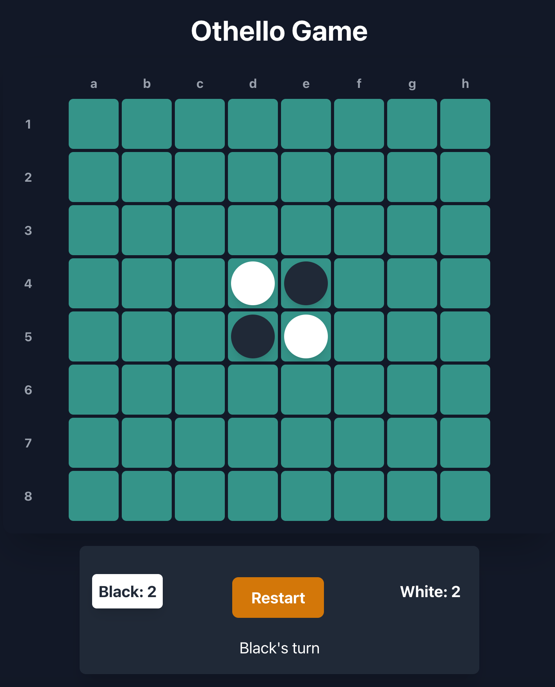

# 오셀로(Othello) AI



## [Click to play](https://fake-dev-log.github.io/othello/)

## 게임규칙

1. 빈 칸에 어떤 돌이 놓였을 때, 가로, 세로, 대각선 방향에 같은 색의 돌이 이미 놓여있고, 그 사이에 다른 색의 돌이 있다면 다른 색의 돌을 같은 색의 돌로 바꾼다. 이를 간단히 '돌을 뒤집는다'고 한다.
2. 돌을 뒤집을 때는 새로 놓인 돌의 가로, 세로, 대각선 방향 각각에서 가장 가까운 같은 색의 돌 사이를 범위로 한다. 즉 [-,w,w,b,w,w,b,-] 과 같은 상황에서 첫번째 빈칸(-)에 돌을 놓는 경우, [b,b,b,b,w,w,b,-] 이다. 가로, 세로, 대각선 모두에서 뒤집을 수 있는 돌이 있다면 모두 뒤집는다.
3. 각 경기자는 흑과 백 중 하나의 색을 부여받고, 흑의 선수로 서로 번갈아 가며 상대의 돌을 뒤집을 수 있는 위치에 자신의 돌을 놓는다.
4. 돌을 놓을 공간이 없다면 차례를 상대에게 넘긴다.
5. 두 경기자 모두가 착수할 곳이 없다면 자신의 색의 돌이 많은 경기자가 이긴다.

## Version 1. 최대최소 탐색(Minimax Search)

### 1. 알고리즘 개요

1. 인공지능은 승리시 최대 보상, 패배시 최소 보상을 얻으며, 비길 경우 0의 보상을 얻는다.
2. 기본적인 최대최소 탐색을 통해 게임이 종료되거나 깊이 제한(=4)에 도달할 때까지 가능한 상태를 탐색한다.
3. 상태 평가 함수는 현재 상태에서 내 돌이 얼마나 많은가를 사용하였다. (그러나 오셀로 게임의 경우 중요한 자리가 있고, 거기에 대한 가중치를 반영해야 한다. 추후 개선한다.)
4. AI는 착수 가능한 상태 중, 자신의 보상을 최대화하는(maximize) 상태를 탐색하여 다음수를 선택한다.
5. 그러나 상대 역시 자신의 보상을 최대화 하는 탐색을 수행하여 다음 수를 계산한다. 이 때 상대의 보상 최대화는 AI의 입장에서는 보상의 최소화(minimize) 탐색이다.
6. 즉, AI의 보상 최대화는 상대의 대응에 따른 보상 최소화를 반영하여 선택된다. 마찬가지로 상대의 대응에 따른 보상 최소화는 다시 AI의 반응에 따른 보상 최대화를 반영한다.
7. 위와 같이 내가 두는 수에 대한 상대의 대응, 그리고 그에 대한 나의 반응을 게임 트리 형태로 깊이 우선 탐색(DFS)을 수행하여 최선의 수를 반환한다.

### 2. 구현

#### 1. 평가 함수

게임이 종료되지 않은 경우 게임의 현 상태를 평가하여야 한다.

가장 단순하게 게임판 위에 놓인 돌의 개수를 통해 점수를 판단했다.

그러나 전술하였듯 오셀로 게임에는 상대적으로 더 중요한 자리와 그렇지 않은 자리가 존재한다.

추후 게임판의 각 자리에 대한 가중치를 반영할 수 있도록 개선한다.

```typescript
function calculateScore(board: State[]): ScoreBoard {
  return board.reduce((score, cell) => {
    if (cell === 'b') score.black++;
    else if (cell === 'w') score.white++;
    return score;
  }, { black: 0, white: 0 });
}
```

### 2. 최대탐색 함수

상태를 판단하여 게임이 종료되었다면 승자 판단을 통해 점수를 반환한다.

최대 깊이 제한에 도달했을 경우 상태 평가 함수에 따른 점수를 반환한다.

그외의 경우에는 AI의 입장에서 착수 가능한 지점을 탐색하여 가장 큰 보상을 반환한다.

이 때, 착수 가능 지점에 대한 보상 탐색은 상대의 대응(상대의 보상 최대화 = AI의 보상 최소화)을 통해 구해진다.

```typescript
// player는 AI를 의미한다.
function maximize(currentState: State[], player: Player, depth: number): number {
  const opponent = player === 'b' ? 'w' : 'b';

  // 현재 상태를 평가하여 점수를 구한다.
  const { black, white } = calculateScore(currentState);
  const playerScore = player === 'b' ? black : white;
  const opponentScore = opponent === 'b' ? black : white;

  const playerPass = shouldPass(currentState, player);
  const opponentPass = shouldPass(currentState, opponent);

  const isGameOver = (black + white === 64) || (playerPass && opponentPass);

  // 결과에 대한 보상 반환
  if (isGameOver) {
    if (playerScore > opponentScore) {
      return Infinity;
    } else if (opponentScore > playerScore) {
      return -Infinity;
    } else {
      return 0;
    }
  }

  if (depth >= DEPTH_BOUND) {
    return playerScore;
  }

  // 최대보상 초기화
  let maxValue = -Infinity;

  // 게임판 전체를 순회하며 착수 가능한 지점을 찾는다.
  for (let idx=0; idx < 64; idx++) {
    const possibleState: State[] | null = validateAndFlip(currentState, idx, player);
    // 착수 가능한 지점이 있을 경우,
    if (possibleState !== null) {
      // 상대가 자신의 보상을 최대화(나의 보상 최소화) 하는 대응을 고려하여 착수 지점의 보상을 계산한다.
      const value = minimize(possibleState, player, depth + 1);
      // 새로운 착수 지점의 보상이 더 큰 경우에는 최대보상을 갱신한다.
      maxValue = Math.max(value, maxValue);
    }
  }
  
  // 최대보상을 반환한다.
  return maxValue;
}
```

### 3. 최소탐색 함수

```typescript
// player는 AI를 의미한다. 결과 보상의 기준이 언제나 AI로 고정되어 있음에 유의해야 한다.
function minimize(currentState: State[], player: Player, depth: number): number {
  const opponent = player === 'b' ? 'w' : 'b';

  const { black, white } = calculateScore(currentState);
  const playerScore = player === 'b' ? black : white;
  const opponentScore = opponent === 'b' ? black : white;

  const playerPass = shouldPass(currentState, player);
  const opponentPass = shouldPass(currentState, opponent);

  const isGameOver = (black + white === 64) || (playerPass && opponentPass);

  if (isGameOver) {
    if (playerScore > opponentScore) {
      return Infinity;
    } else if (opponentScore > playerScore) {
      return -Infinity;
    } else {
      return 32;
    }
  }
  
  if (depth >= DEPTH_BOUND) {
    return playerScore;
  }

  // 최소보상 초기화
  let minValue = Infinity;

  for (let idx=0; idx < 64; idx++) {
    // 상대가 착수할 수 있는 지점을 찾는다.
    const possibleState: State[] | null = validateAndFlip(currentState, idx, opponent);
    // 상대가 착수할 수 있는 지점이 있는 경우,
    if (possibleState !== null) {
      // 해당 착수에 대한 AI의 반응에 따른 보상 극대화를 고려하여 착수 지점의 보상을 계산한다.
      const value = maximize(possibleState, player, depth + 1);
      // 최소보상 갱신
      minValue = Math.min(value, minValue);
    }
  }

  // 최소보상 반환
  return minValue;
}
```

### 4. 최대최소 탐색 함수

AI의 입장에서 상대(사람)의 최소화 탐색을 고려한 최대 탐색을 수행하여 최선의 착수 지점을 반환한다.

```typescript
function minimax(currentState: State[], player: Player): number {
  // 최대보상 및 최선의 착수 지점 초기화
  let maxValue = -Infinity;
  let bestMove = -1;

  // 게임판 전체를 순회하며 착수 가능한 지점을 찾는다.
  for (let idx=0; idx < 64; idx++) {
    const possibleState: State[] | null = validateAndFlip(currentState, idx, player);
    
    // 착수 가능한 지점이 있을 경우,
    if (possibleState !== null) {
      // 상대의 대응을 고려하여 보상을 계산한다.
      const value = minimize(possibleState, player, 1);
      
      // 착수 가능한 지점이 초기화 상태이거나 해당 착수 지점의 보상이 현재의 최대보상보다 크다면 최대보상과 최선의 착수지점을 갱신한다.
      if (bestMove === -1 || value > maxValue) {
        maxValue = value;
        bestMove = idx;
      }
    }
  }

  // 최선의 착수지점 반환
  return bestMove;
}
```

## 3. 개선방안

### 1. 평가 함수 개선

앞서 기술하였듯이 오셀로에서는 전략적으로 더 중요한 자리와 덜 중요한 자리가 있다.

각 자리마다 가중치를 부여하고, 이를 통해 AI가 전략적으로 더 중요한 자리를 먼저 선택할 수 있도록 개선한다.

### 2. 네가맥스(Negamax) 변형

현재의 최대화 탐색과 최소화 탐색의 구조는 거의 똑같은 코드가 중복되고 있다.

현재 턴의 플레이어에게는 점수 최대화, 상대 턴에는 점수를 음수로 바꿔서 다시 극대화 문제를 적용하는 네가맥스(Negamax) 변형을 적용할 수 있다.

이를 통해 두 탐색 코드를 하나의 재귀함수로 합쳐서 간결하게 관리할 수 있다.

추후 네가맥스를 반영한다.

### 3. 알파-베타 가지치기

이전의 [삼목게임(tic-tac-toe)](https://github.com/fake-dev-log/minimax_machine)의 예에서 볼 수 있듯, 알파-베타 가지치기를 통해 탐색량을 크게 줄일 수 있다.

탐색량이 줄어든다면 동일한 시간동안 더 깊은 탐색이 가능하므로 더 좋은 선택을 할 수 있게 된다.

이후 알파-베타 가지치기 방법을 적용하여 알고리즘을 개선한다.